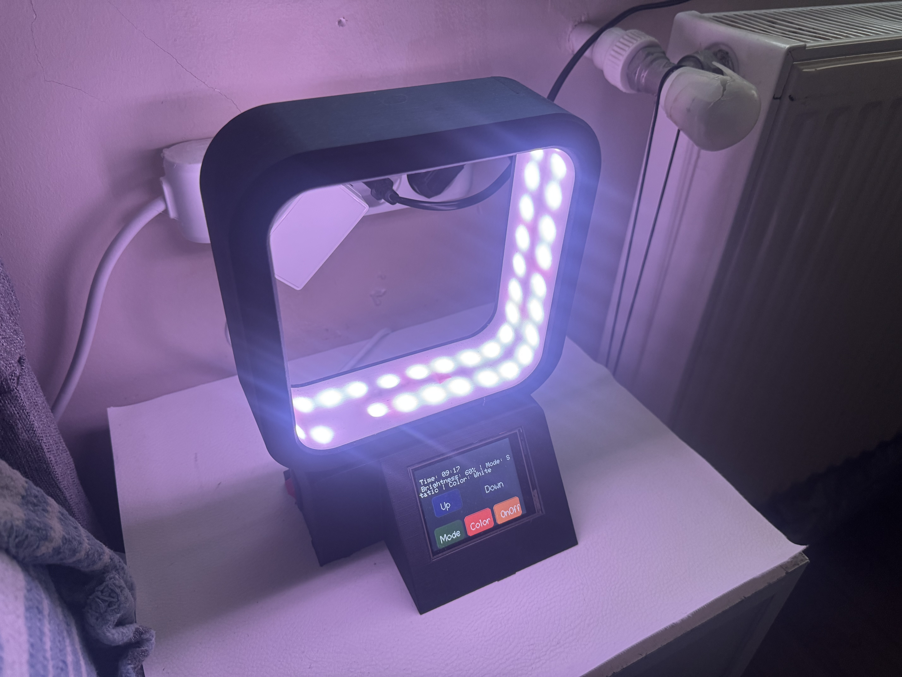

# SmartLamp-SmartGlow


Welcome to the **SmartLamp-SmartGlow** project! This is an IoT-based smart lighting solution featuring a 2.4" TFT touchscreen and two addressable WS2812B LED strips. The lamp can be controlled via a touchscreen interface or remotely through Home Assistant using MQTT. It supports multiple lighting effects, brightness adjustment, and color selection.

## Table of Contents
- [Features](#features)
- [Hardware Requirements](#hardware-requirements)
- [Software Requirements](#software-requirements)
- [Installation](#installation)
- [Usage](#usage)
- [Configuration](#configuration)
- [Code Structure](#code-structure)
- [Contributing](#contributing)
- [License](#license)
- [Acknowledgments](#acknowledgments)

## Features
- **Dual LED Control**: Manages two separate WS2812B LED strips (30 and 32 LEDs).
- **Touchscreen Interface**: 2.4" ILI9341 TFT with XPT2046 touchscreen for local control.
- **Multiple Effects**: Static, Breath, Rainbow, Chase, Blink, and Wave animations.
- **Remote Control**: Integration with Home Assistant via MQTT.
- **Brightness Adjustment**: Adjustable brightness levels (0-100%).
- **Color Selection**: 15 predefined colors with RGB support.
- **Time Display**: Real-time clock using NTP (Network Time Protocol).
- **Energy Saving**: Automatic screen timeout during nighttime.

## Hardware Requirements
To build this project, you will need the following components:

### Components
- **ESP32 Development Board** (e.g., ESP32-WROOM-32)
- **2.4" ILI9341 TFT LCD with XPT2046 Touchscreen** (320x240 resolution)
- **WS2812B LED Strips** (1x 30 LEDs, 1x 32 LEDs)
- **Level Shifter** (optional, 3.3V to 5V, e.g., 74HCT245)
- **Power Supply**: 5V, minimum 3A
- **Jumper Wires** (male-to-female and male-to-male)
- **Breadboard** (for prototyping)
- **Resistor**: 220-470 Ohm (1 piece, for LED data line)
- **Capacitor**: 1000µF, 6.3V or higher (optional, for power stabilization)

### Pin Connections
| ESP32 Pin       | Connection                |
|------------------|---------------------------|
| 3.3V            | TFT VCC, Level Shifter (if used) |
| 5V (External)   | LED Strips VCC            |
| GND             | TFT GND, LED Strips GND, Power Supply GND |
| GPIO 5          | LED Strip 1 DIN (with 220-470 Ohm resistor) |
| GPIO 13         | LED Strip 2 DIN (with 220-470 Ohm resistor) |
| GPIO 21         | TFT Backlight Control     |
| GPIO 25         | TFT CLK (XPT2046_CLK)     |
| GPIO 32         | TFT MOSI (XPT2046_MOSI)   |
| GPIO 33         | TFT CS (XPT2046_CS)       |
| GPIO 39         | TFT MISO (XPT2046_MISO)   |

- **Note**: Connect all GND pins to a common ground. Use a separate 5V power supply for LED strips to avoid overloading the ESP32.

### Project Photos

**Project Overview**





## Software Requirements
- **Arduino IDE**: Version 1.8.x or later.
- **ESP32 Board Support**: Install via Arduino Board Manager.
- **Libraries**:
  - `TFT_eSPI` (for TFT display)
  - `XPT2046_Touchscreen` (for touchscreen)
  - `FastLED` (for LED control)
  - `Preferences` (for storing settings)
  - `WiFi` and `PubSubClient` (for MQTT)
  - `NTPClient` (for time synchronization)
- **Home Assistant**: For MQTT integration (optional).
- **MQTT Broker**: e.g., Mosquitto.

## Installation
1. **Set Up Arduino IDE**:
   - Install the Arduino IDE and add ESP32 board support (via Board Manager).
   - Install the required libraries using the Library Manager or manually.

2. **Connect Hardware**:
   - Assemble the circuit according to the pin connections table above.
   - Ensure the power supply is connected and all GNDs are common.

3. **Configure the Code**:
   - Open `dual_smart_led_lamp.ino` in Arduino IDE.
   - Update the following constants with your network and MQTT details:
     - `ssid`: Your WiFi SSID
     - `password`: Your WiFi password
     - `mqtt_server`: Your MQTT broker IP address
     - `mqtt_user`: Your MQTT username
     - `mqtt_password`: Your MQTT password

4. **Upload the Code**:
   - Select your ESP32 board and port in Arduino IDE.
   - Click "Upload" to flash the code to the ESP32.

5. **Test the Setup**:
   - Power on the device and check the touchscreen interface.
   - Verify LED strips light up and respond to touch inputs.

## Usage
- **Touchscreen Controls**:
  - **Up/Down Buttons**: Adjust brightness.
  - **Mode Button**: Cycle through lighting effects (Static, Breath, Rainbow, Chase, Blink, Wave).
  - **Color Button**: Cycle through 15 predefined colors.
  - **On/Off Button**: Toggle the LED strips on or off.
- **Home Assistant Integration**:
  - Configure MQTT in Home Assistant using the provided `configuration.yaml` snippet.
  - Control the lamp remotely via the Home Assistant UI.

## Configuration
### Example `configuration.yaml` for Home Assistant
```yaml
# Loads default set of integrations. Do not remove.
default_config:

# Load frontend themes from the themes folder
frontend:
  themes: !include_dir_merge_named themes

# MQTT Integration
mqtt:
  light:
    - name: "smartlamp-smartglow"
      state_topic: "smartlamp/smartglow/state"
      command_topic: "smartlamp/smartglow/state"
      brightness_state_topic: "smartlamp/smartglow/brightness"
      brightness_command_topic: "smartlamp/smartglow/brightness"
      brightness_scale: 100
      rgb_state_topic: "smartlamp/smartglow/color"
      rgb_command_topic: "smartlamp/smartglow/color"
      effect_state_topic: "smartlamp/smartglow/effect"
      effect_command_topic: "smartlamp/smartglow/effect"
      effect_list:
        - Static
        - Breath
        - Rainbow
        - Chase
        - Blink
        - Wave
      json_attributes_topic: "smartlamp/smartglow/color_name"
      optimistic: false
      qos: 0

automation: !include automations.yaml
script: !include scripts.yaml
scene: !include scenes.yaml
```

## Code Structure
- **`dual_smart_led_lamp.ino`**: Main Arduino sketch containing:
  - Setup and loop functions.
  - Functions for drawing the interface (`drawInterface`), updating status (`updateStatus`), and controlling LEDs (`updateLEDs`).
  - MQTT handling (`publishState`, `callback`, `reconnect`).
  - Settings management (`saveSettings`, `loadSettings`).

## Contributing
Contributions are welcome! To contribute:
1. Fork the repository.
2. Create a new branch (`git checkout -b feature-branch`).
3. Make your changes and commit them (`git commit -m "Add new feature"`).
4. Push to the branch (`git push origin feature-branch`).
5. Open a Pull Request.

Please ensure your code follows the project's coding style and includes appropriate documentation.

## License
This project is licensed under the MIT License. See the [LICENSE](LICENSE) file for details.

## Acknowledgments
- Thanks to the open-source community for libraries like `TFT_eSPI`, `FastLED`, and `PubSubClient`.
- Inspired by IoT and smart home projects shared on GitHub and other platforms.
